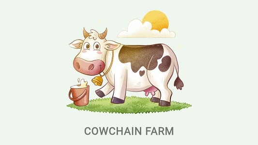

<br>
<div align="center">

<p align="center">Smart contract-based Cow Farming web app built with Flutter and Soroban</p>
</div>

## About Cowchain Farm

Cowchain Farm combines Rust-based smart contracts built with [Soroban](https://soroban.stellar.org) on Stellar
blockchain, and a web app client to
access the smart contracts functionality built with one of the most popular cross-platform
frameworks, [Flutter](https://flutter.dev).

Cowchain Farm smart contract will cover several capabilities of Soroban that exist in
the [Preview 10 release](https://soroban.stellar.org/docs/reference/releases), which include:

1. Authentication and authorization
2. Error handling
3. Custom types
4. Contract initialization
5. Contract upgrading
6. Payment transfer
7. Data storage expiration

While the Cowchain Farm web app will cover the following:

1. Calling Soroban smart contract function using [Flutter Stellar SDK](https://pub.dev/packages/stellar_flutter_sdk)
2. Communication with the [Freighter](https://www.freighter.app) browser extension

## Get Started

This article is specifically about the Soroban smart contract for Cowchain Farm. Discussion of the Cowchain Farm web app
is in the [Cowchain Farm App repository](https://github.com/hasToDev/cowchain-farm-app).

The Cowchain Farm smart contract in this repository was developed using `Rust version 1.73.0-nightly`
and `Soroban CLI 0.9.1`

## Install Rust and Soroban CLI

The first step you have to do is install Rust. You can follow the steps to install Rust in the following article:

- [Install Rust - Rust Programming Language](https://www.rust-lang.org/tools/install)
- [Walkthrough: Installing Rust on Windows](https://www.alpharithms.com/installing-rust-on-windows-403718/)
- [How To Install Rust on Ubuntu 20.04](https://www.digitalocean.com/community/tutorials/install-rust-on-ubuntu-linux)

Next we install Soroban CLI:

```shell
cargo install --locked --version 0.9.4 soroban-cli
```

Confirm that both Rust and Soroban CLI are installed by running `rustc --version` and `soroban --version`.

You should receive a result that is more or less similar to:

```text
rustc 1.73.0-nightly (32303b219 2023-07-29)

soroban 0.9.1 (b5e8586344ab52c0a1b8988b44b0c4e516a473ce)     
soroban-env 0.0.17 (400d806387140553e4e685d232deb3a807ec0e36)
soroban-env interface version 85899345971                    
stellar-xdr 0.0.17 (0f16673441898162c9996da6117be2280ef8fd84)
xdr next (e372df9f677961aac04c5a4cc80a3667f310b29f)
```

## Clone, Build, and Deploy

1. Clone the repository:
    ```shell
    git clone https://github.com/hasToDev/cowchain-farm-soroban.git
    ```

2. Build the contract:
   ```shell
   cargo build --target wasm32-unknown-unknown --release
   ```

3. Deploy the contract to Futurenet:
   ```shell
   soroban contract deploy \
   --wasm target/wasm32-unknown-unknown/release/cowchain-farm-soroban.wasm \
   --rpc-url https://rpc-futurenet.stellar.org:443 \
   --network-passphrase 'Test SDF Future Network ; October 2022'
   ```
   After the deployment is complete, you will receive a **Contract Address**. Save that address to be used in calling
   the contract functions.

   The form of **Contract Address** will be similar
   to `CB7UCV29SYKUFRZNEIMKVW5XKSJCGTMBCSJFN5OJ2SSXBTPRXO42XGT8`.<br><br>

4. (optional) Install the contract to Futurenet:
   ```shell
   soroban contract install \
   --wasm target/wasm32-unknown-unknown/release/cowchain-farm-soroban.wasm \
   --rpc-url https://rpc-futurenet.stellar.org:443 \
   --network-passphrase 'Test SDF Future Network ; October 2022'
   ```
   After the installation process is complete, you will receive a **Contract ID**.

   The form of **Contract ID** will be similar
   to `900c8b247d0acz41befcf6a441ebddf6f5pf5cKe10d79a5ef88Sa315665bf926`.<br>

   <br>You can use this Contract ID as a **WASM Hash** argument that will be needed when using a contract deployer
   or when you want to upgrade your current contract.

## Prerequisites

### Accounts

Before calling Cowchain Farm smart contract function, make sure you have at least 2 **Stellar FUTURENET account**. You
can create the account using Stellar
Laboratory [here](https://laboratory.stellar.org/#account-creator?network=futurenet).

The first account will be used as an administrator account, while the second account will be used as a user account.

For example, we will use the two accounts below as administrator and user:

| Description | ADMINISTRATOR                                            | 
|-------------|----------------------------------------------------------|
| Public Key  | GCMEOWWTRG6QD2S5F2V66CJTT7EG4MDPL7U523SGTLOHZPPUAJFGNIS6 |
| Secret Key  | SBNESSDQWIDIO7NYDAHM2STHSVZPIIPM3OGT6PB56DL2EE4XXIHECYYP |

| Description | USER                                                     | 
|-------------|----------------------------------------------------------|
| Public Key  | GCK2IJZ3XTVRZWX27YITE2DBIDSHDIVNIICLJ63P6XXFAFHVFFWS52UY |
| Secret Key  | SDM6DSM6Y3KZ3AN5FW632FYRW3RND6K42LSMEKUGCIP6FPSBHL5RJFDE |

### Initialization Password

When we initialize this contract, we will need the initialization password, which we have previously hard-coded into the
<u>init</u> function. You can find this password in the [lib.rs](src/lib.rs) file.

**IMPORTANT:** Be sure to replace the password in the <u>init</u> function with your own before deploying.

The primary purpose of using this password is to prevent others from initializing your contract. Instead, you can use
the deployer contract. the tutorial is [here](https://soroban.stellar.org/docs/basic-tutorials/deployer).

### Stellar Native Asset Contract Address

When we initialize this contract, we will need the address of Stellar native asset token. You can find the address using
Soroban CLI:

```shell
soroban lab token id \
--asset native \
--rpc-url https://rpc-futurenet.stellar.org:443 \
--network-passphrase 'Test SDF Future Network ; October 2022'
```

The Stellar native asset token contract address is `CB64D3G7SM2RTH6JSGG34DDTFTQ5CFDKVDZJZSODMCX4NJ2HV2KN7OHT`.

## Calling Smart Contract Function

1. Contract Initialization
   <br> After deployment, the first function we should call is initialization.
   <br> Required auth: <u>ADMIN account authorization</u>.
   <br> Required arguments: <u>ADMIN account
   address</u>, <u>native token address</u>, and <u>messsage</u> AKA <u>password</u>.
   ```shell
   soroban contract invoke \
   --id CB7UCV29SYKUFRZNEIMKVW5XKSJCGTMBCSJFN5OJ2SSXBTPRXO42XGT8 \
   --source SBNESSDQWIDIO7NYDAHM2STHSVZPIIPM3OGT6PB56DL2EE4XXIHECYYP \
   --rpc-url https://rpc-futurenet.stellar.org:443 \
   --network-passphrase 'Test SDF Future Network ; October 2022' \
   --fee 12345678 \
   -- \
   init \
   --admin GCMEOWWTRG6QD2S5F2V66CJTT7EG4MDPL7U523SGTLOHZPPUAJFGNIS6 \
   --native_token CB64D3G7SM2RTH6JSGG34DDTFTQ5CFDKVDZJZSODMCX4NJ2HV2KN7OHT \
   --message "kBfn7v17QdX4kD856bX2mBj1Y"
   ```
2. Contract Upgrade
   <br> Required auth: <u>ADMIN account authorization</u>.
   <br> Required arguments: <u>WASM Hash</u> from *soroban contract install*.
   ```shell
   soroban contract invoke \
   --id CB7UCV29SYKUFRZNEIMKVW5XKSJCGTMBCSJFN5OJ2SSXBTPRXO42XGT8 \
   --source SBNESSDQWIDIO7NYDAHM2STHSVZPIIPM3OGT6PB56DL2EE4XXIHECYYP \
   --rpc-url https://rpc-futurenet.stellar.org:443 \
   --network-passphrase 'Test SDF Future Network ; October 2022' \
   --fee 12345678 \
   -- \
   upgrade \
   --new_wasm_hash 900c8b247d0acz41befcf6a441ebddf6f5pf5cKe10d79a5ef88Sa315665bf926
   ```

3. Extend or Bump Contract Instance Storage Lifetime
   <br> This will bump your contract instance storage lifetime to the N ledger after the current ledger sequence.
   <br> Required arguments: <u>Ledger amount</u>.
   ```shell
   soroban contract invoke \
   --id CB7UCV29SYKUFRZNEIMKVW5XKSJCGTMBCSJFN5OJ2SSXBTPRXO42XGT8 \
   --rpc-url https://rpc-futurenet.stellar.org:443 \
   --network-passphrase 'Test SDF Future Network ; October 2022' \
   --fee 12345678 \
   -- \
   bump_instance \
   --ledger_amount 1234
   ```

4. Contract Health Check
   ```shell
   soroban contract invoke \
   --id CB7UCV29SYKUFRZNEIMKVW5XKSJCGTMBCSJFN5OJ2SSXBTPRXO42XGT8 \
   --rpc-url https://rpc-futurenet.stellar.org:443 \
   --network-passphrase 'Test SDF Future Network ; October 2022' \
   --fee 12345678 \
   -- \
   health_check
   ```

5. Cow Purchase
   <br> Required auth: <u>USER account authorization</u>.
   <br> Required arguments: <u>USER account
   address</u>, <u>cow name</u>, <u>cow id</u>, and <u>cow breed</u>.
   ```shell
   soroban contract invoke \
   --id CB7UCV29SYKUFRZNEIMKVW5XKSJCGTMBCSJFN5OJ2SSXBTPRXO42XGT8 \
   --source SDM6DSM6Y3KZ3AN5FW632FYRW3RND6K42LSMEKUGCIP6FPSBHL5RJFDE \
   --rpc-url https://rpc-futurenet.stellar.org:443 \
   --network-passphrase 'Test SDF Future Network ; October 2022' \
   --fee 12345678 \
   -- \
   buy_cow \
   --user GCK2IJZ3XTVRZWX27YITE2DBIDSHDIVNIICLJ63P6XXFAFHVFFWS52UY \
   --cow_name supercattle \
   --cow_id 8e6bbeyd144a4fjY753r80c286d781c7074fb371 \
   --cow_breed 4
   ```

6. Cow Sale
   <br> Required auth: <u>USER account authorization</u>.
   <br> Required arguments: <u>USER account address</u>, and <u>cow id</u>.
   ```shell
   soroban contract invoke \
   --id CB7UCV29SYKUFRZNEIMKVW5XKSJCGTMBCSJFN5OJ2SSXBTPRXO42XGT8 \
   --source SDM6DSM6Y3KZ3AN5FW632FYRW3RND6K42LSMEKUGCIP6FPSBHL5RJFDE \
   --rpc-url https://rpc-futurenet.stellar.org:443 \
   --network-passphrase 'Test SDF Future Network ; October 2022' \
   --fee 12345678 \
   -- \
   sell_cow \
   --user GCK2IJZ3XTVRZWX27YITE2DBIDSHDIVNIICLJ63P6XXFAFHVFFWS52UY \
   --cow_id 8e6bbeyd144a4fjY753r80c286d781c7074fb371
   ```

7. Cow Price Appraisal
   <br> Required arguments: <u>cow id</u>.
   ```shell
   soroban contract invoke \
   --id CB7UCV29SYKUFRZNEIMKVW5XKSJCGTMBCSJFN5OJ2SSXBTPRXO42XGT8 \
   --rpc-url https://rpc-futurenet.stellar.org:443 \
   --network-passphrase 'Test SDF Future Network ; October 2022' \
   --fee 12345678 \
   -- \
   cow_appraisal \
   --cow_id 8e6bbeyd144a4fjY753r80c286d781c7074fb371
   ```

8. Cow Feeding
   <br> Required arguments: <u>USER account address</u>, and <u>cow id</u>.
   ```shell
   soroban contract invoke \
   --id CB7UCV29SYKUFRZNEIMKVW5XKSJCGTMBCSJFN5OJ2SSXBTPRXO42XGT8 \
   --rpc-url https://rpc-futurenet.stellar.org:443 \
   --network-passphrase 'Test SDF Future Network ; October 2022' \
   --fee 12345678 \
   -- \
   feed_the_cow \
   --user GCK2IJZ3XTVRZWX27YITE2DBIDSHDIVNIICLJ63P6XXFAFHVFFWS52UY \
   --cow_id 8e6bbeyd144a4fjY753r80c286d781c7074fb371
   ```

9. Retrieve All User's Cow Data
   <br> Required auth: <u>USER account authorization</u>.
   <br> Required arguments: <u>USER account address</u>.
   ```shell
   soroban contract invoke \
   --id CB7UCV29SYKUFRZNEIMKVW5XKSJCGTMBCSJFN5OJ2SSXBTPRXO42XGT8 \
   --source SDM6DSM6Y3KZ3AN5FW632FYRW3RND6K42LSMEKUGCIP6FPSBHL5RJFDE \
   --rpc-url https://rpc-futurenet.stellar.org:443 \
   --network-passphrase 'Test SDF Future Network ; October 2022' \
   --fee 12345678 \
   -- \
   get_all_cow \
   --user GCK2IJZ3XTVRZWX27YITE2DBIDSHDIVNIICLJ63P6XXFAFHVFFWS52UY
   ```

## State Expiration

The Cowchain Farm contract, upon initialization, will have its INSTANCE storage lifetime bumped to 50 weeks.

User registration data has 1 week of lifetime in PERSISTENT storage, and it will be bumped every time
function **buy_cow**, **sell_cow**, and **feed_the_cow** is called.

While each cow only has 24 hours of lifetime in TEMPORARY storage. It must be bumped by calling the **feed_the_cow**
function before the time is up. Otherwise, the data will be lost.

## License

The Cowchain Farm is distributed under an MIT license. See the [LICENSE](LICENSE) for more information.

[](https://opensource.org/licenses/MIT)

## Contact

[Hasto](https://github.com/hasToDev) - [@HasToDev](https://twitter.com/HasToDev)
